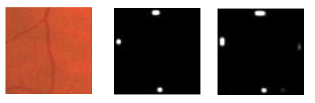
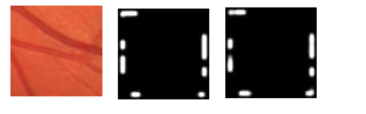

# Hourglass-Pytorch


> Author: Yuchao Gu

> E-mail: 2015014178@buct.edu.cn

> Date: 2018-05-27

>Description: The code is an pytorch implementation of [《Iterative Deep Learning for Network Topology Extraction》](https://arxiv.org/abs/1712.01217). But I have not finished it, it is still in the patch training step.

---

## Overview

### Data and Preprocess

[DRIVE: Digital Retinal Images for Vessel Extraction](http://www.isi.uu.nl/Research/Databases/DRIVE/) You can download raw data here. Then we need to do some processes to generate our train data:

 1、Randomly choose a foreground pixel as the center pixel, then crop a patch(64*64) around the center pixel.

 2、Find pixels at the boder which are foreground. In order to detect whether they are connected to the center pixel, we make a shortest path from the border to the center. If cost of this path is smaller than INF(we set background INF), we generate a Gaussian peak around this pixel.
 
### Result





left is patch data, middle is label and right is our connective model ouput

### Training

python patchConnectionTrain.py

### Visiualize

tensorboard --logdir=log

---

## How to use

### Dependencies

This code depends on the following libraries:

* Python 3.6
* Pytorch
* TensorboardX
* Scikit-image
* PIL

### structure
```
 hourglass-network
│
├── retinapatch.zip  # my preprocessed train data and label
│ 
├── gyclab # my utils for image segmentation
│ 
├── log # tensorboard visiualize
│ 
├── readmeDisplay  # some images for readme
│ 
├── result # train output
│ 
├── genConnectiveData.py # my implementation to generate data for patch model
│ 
├── patchConnectionTrain.py # train code
│
└── readme.md # introduce to this project
```

